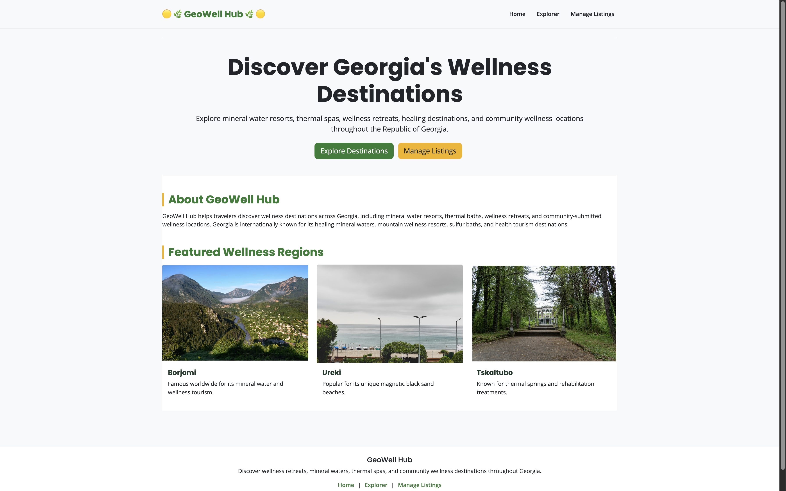
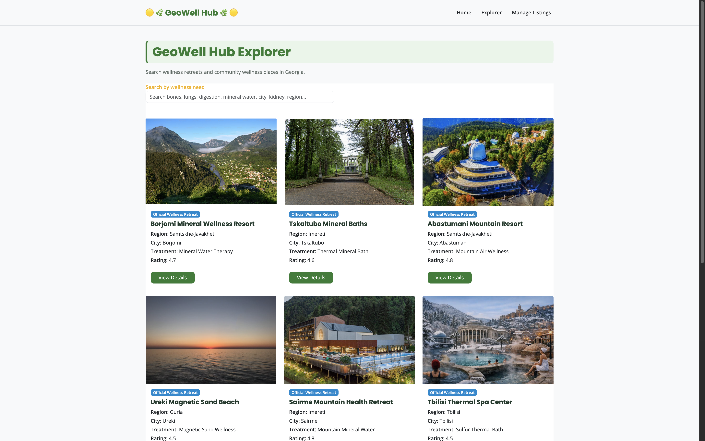
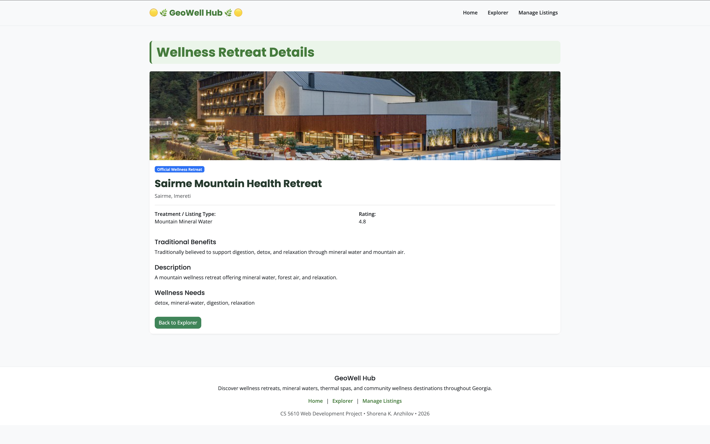
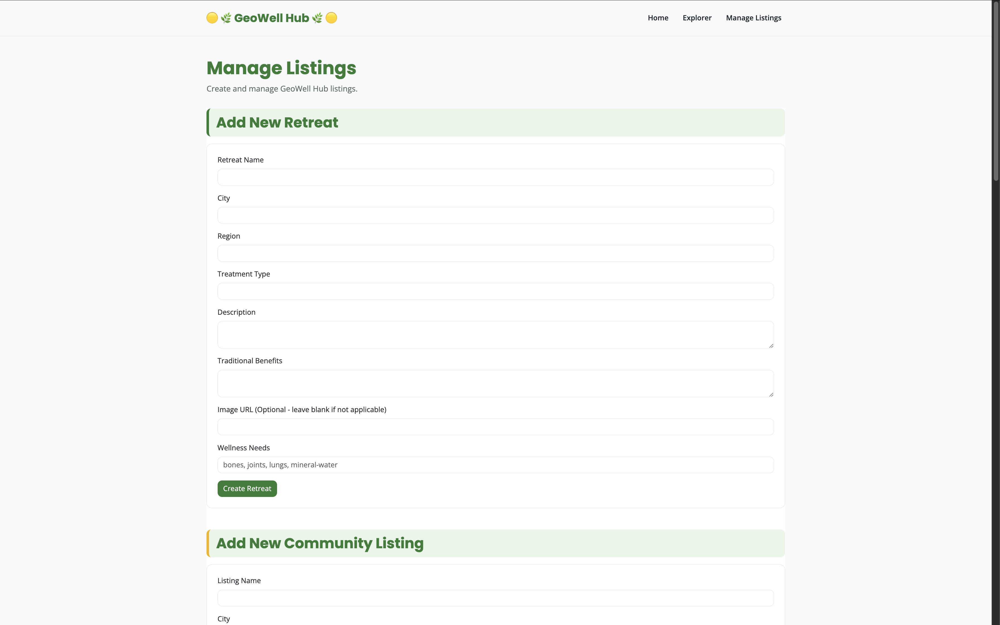
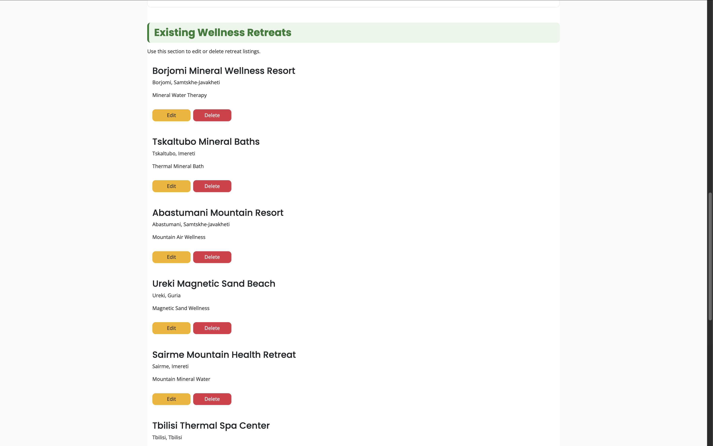

# GeoWell Hub

## Project Description

GeoWell Hub is a full-stack wellness tourism web application designed to help users discover wellness destinations throughout the Republic of Georgia.

The inspiration for GeoWell Hub comes from my birth country republic of Georgia which is renowned for its mineral water resorts, thermal springs, mountain retreats, and rich health tourism traditions. I created this platform to provide travelers and wellness enthusiasts with a centralized resource for exploring wellness destinations and learning about their potential health and wellness benefits.

The platform enables users to:

- Discover official wellness resorts and retreats across Georgia.
- Explore community-submitted wellness and health-focused locations.
- Search destinations based on specific wellness and vitality needs.
- View detailed information about each destination, including amenities, wellness offerings, and location details.
- Manage destination listings through a complete Create, Read, Update, and Delete (CRUD) interface.

GeoWell Hub combines tourism, wellness, and community engagement into a single platform, making it easier for users to find destinations that support relaxation, recovery, and overall well-being while promoting Georgia's unique wellness tourism opportunities.

The website consists of four pages:

- Home Page
- Explorer Page
- Details Page
- Manage Listings Page

Visitors can explore mineral water resorts, thermal spas, mountain wellness destinations, and community-submitted wellness locations while learning about traditional wellness benefits and treatments.

---

## Live Application

### Website

[GeoWell Hub](https://geowellhub.onrender.com/)

### GitHub Repository

[GitHub Repository](https://github.com/ShorenaK/GeoWellHub)

### Presentation Deck

[Presentation Slides](https://github.com/ShorenaK/GeoWellHub](https://docs.google.com/presentation/d/1Q8tTILVdC-Fh7TXnOCSoZfa-My0H0MSRdMGZaqvzRyk/edit?usp=sharing)

---

## Website Preview

### Home Page

### Explorer Page

### Details Page

### Manage Listings Page

---

## Technologies Used

### Front-End

- HTML5
- CSS3
- JavaScript (ES6 Modules)
- Bootstrap 5

### Back-End

- Node.js
- Express.js
- MongoDB Native Driver
- MongoDB (Docker Container)

### Database

- MongoDB Atlas

### Development Tools

- Visual Studio Code
- Git
- GitHub
- Docker
- MongoDB Compass
- Thunder Client
- ESLint
- Prettier
- npm

### Deployment

- Render

This application is deployed on Render and uses MongoDB Atlas as its cloud database.

### Hosting Platform

- Render (Application Hosting)
- MongoDB Atlas (Cloud Database)

---

### Important Note

This application is deployed using Render's free tier.

Because free Render services automatically spin down after periods of inactivity, the application may take approximately 30–60 seconds to wake up when accessed for the first time.

If the application does not load immediately, please wait a moment and refresh the page once the service becomes active.

All functionality, including CRUD operations and database integration, will work normally after the application finishes waking up.

--- 

## Features

### Wellness Destination Explorer

- Browse official wellness retreats
- Browse community wellness listings
- Search by wellness needs
- View destination details

### Listing Management

- Create retreat listings
- Create community listings
- Edit listings
- Delete listings
- Manage wellness destinations

### Destination Details

- View destination images
- View descriptions
- View traditional wellness benefits
- View ratings
- View wellness needs

---

## Large Dataset Requirement

To satisfy the project requirement for large datasets, a dataset containing more than 1000 records was generated using Mockaroo.

The generated records were:

- Exported into `MOCK_DATA.json`
- Inserted using `seedLargeDataset.js`
- Imported into MongoDB
- Successfully tested through the application

The large dataset was retained for testing and validation purposes.

For deployment, a smaller production dataset was used to provide a better user experience and improve application performance.

---

## Tools Used for Testing

- Thunder Client
- MongoDB Compass
- Browser Developer Tools
- MongoDB Native Driver
- Express.js
- Node.js

---

## Challenges Encountered

Some challenges encountered during development included:

- Implementing edit functionality without interfering with the Create Listing form
- Displaying community listings correctly on the Explorer page
- Displaying community listings correctly on the Manage Listings page
- Supporting Details pages for both Retreats and Community Listings

---

## Future Improvements

- User authentication and account management
- User reviews and destination ratings
- Image upload functionality
- Advanced search and filtering
- Interactive map integration
- Mobile application development
- Wellness destination verification
- Personalized wellness recommendations

---

## Project Highlights

Some features and accomplishments that I am particularly proud of include:

- Building a full-stack wellness tourism application
- Implementing complete CRUD functionality
- Supporting both official and community wellness listings
- Creating a responsive and accessible user interface
- Successfully integrating MongoDB with Node.js and Express
- Generating and validating a dataset containing more than 1000 records
- Creating a clean and user-friendly design inspired by wellness tourism

The final application provides a centralized platform for discovering wellness destinations throughout Georgia while demonstrating full-stack web development concepts and database integration.

### Developed By **Shorena K. Anzhilov**

### GitHub [ShorenaK](https://github.com/ShorenaK)

### LinkedIn [Shorena K. Anzhilov](https://www.linkedin.com/in/shorenaanzhilov/)

---

## Contact

If you have any questions or feedback, please feel free to contact me:

[Email Me](mailto:shorenaanzhilov@gmail.com)

---

## License

This project is licensed under the MIT License.

---
