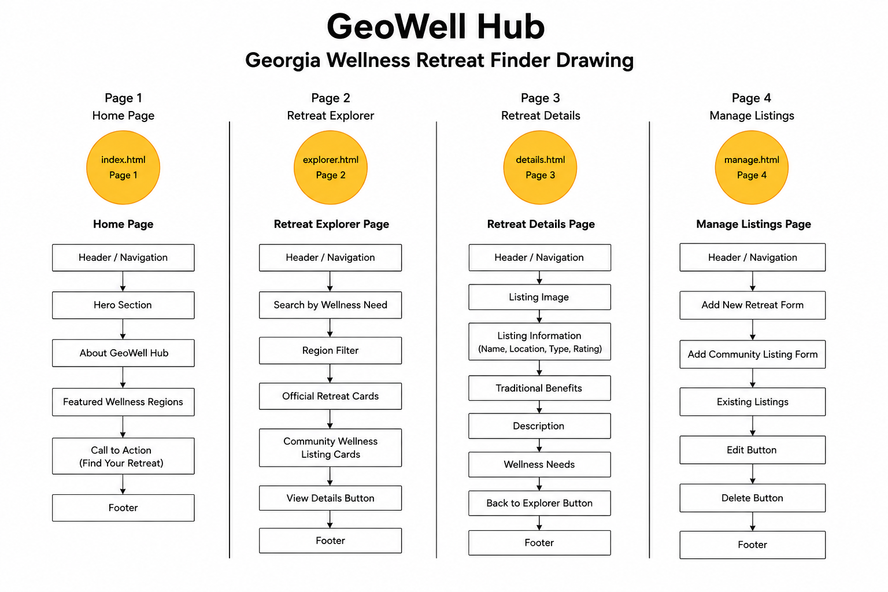
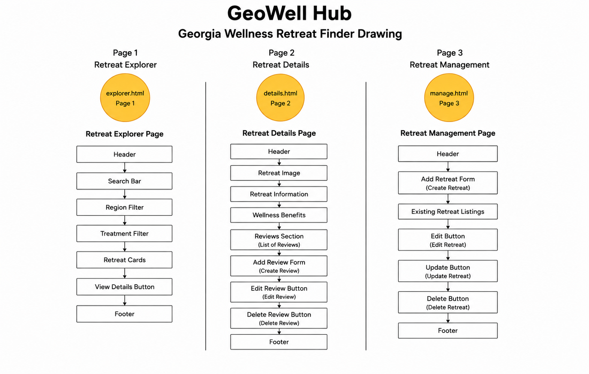
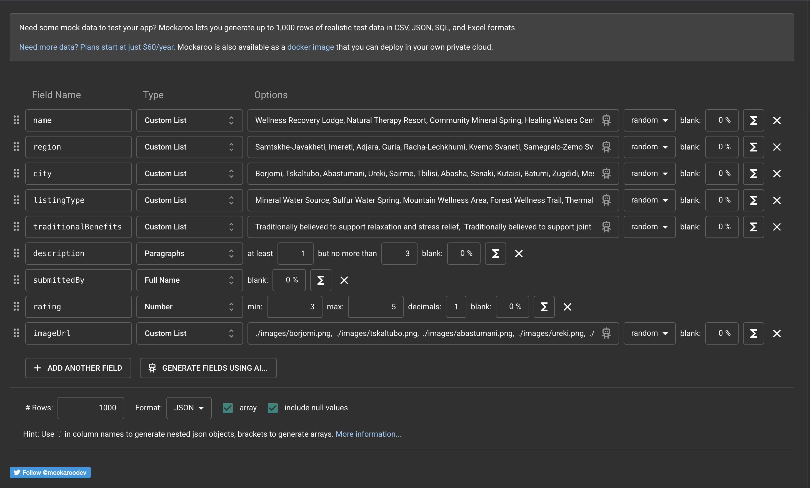
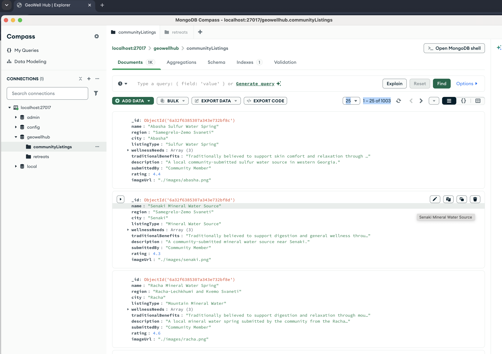
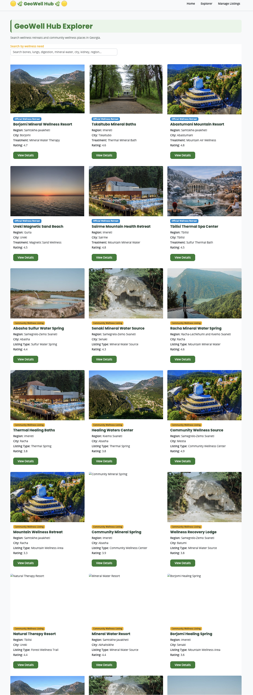
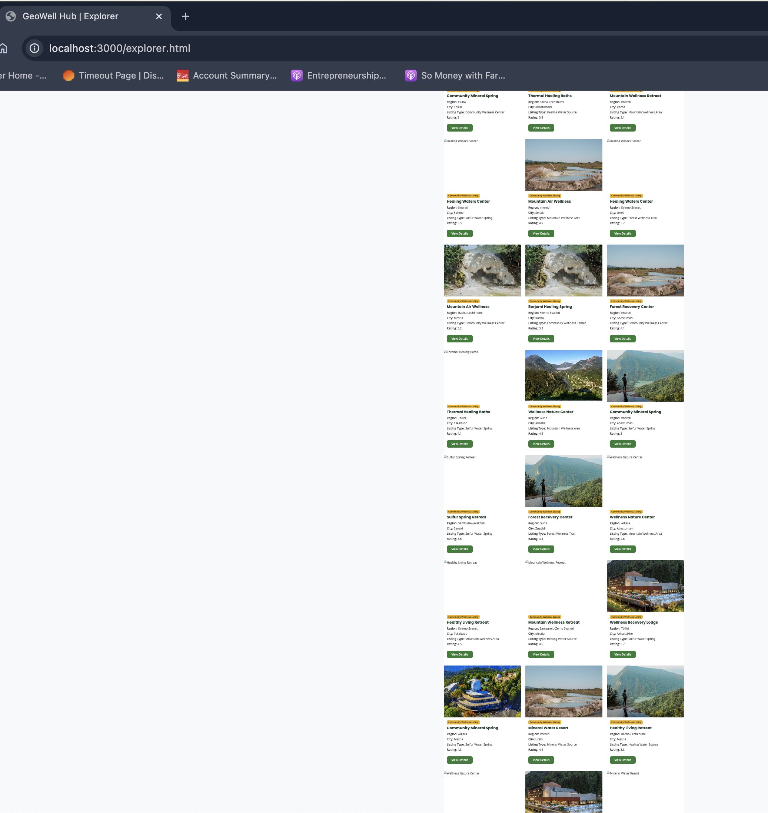
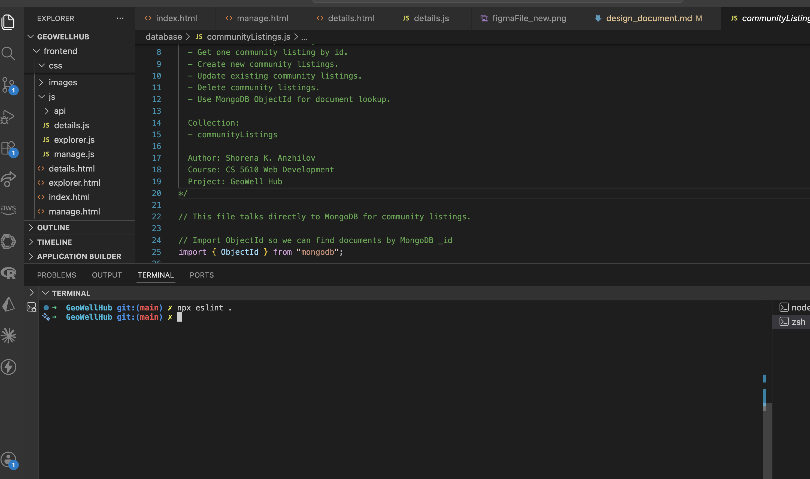
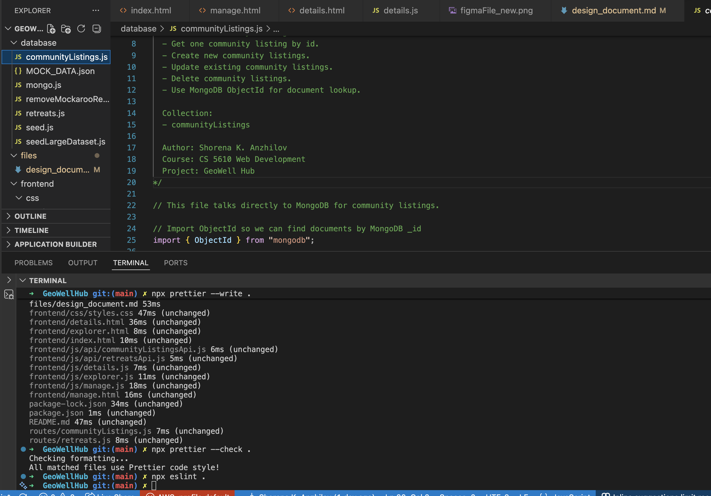

# GeoWell Hub Design Document

## Project Overview

GeoWell Hub is a wellness tourism web application designed to help users discover wellness destinations throughout Georgia. The application allows users to browse official wellness retreats and community-submitted wellness locations, search by wellness needs, view detailed destination information, and manage wellness listings.

The application was designed with simplicity, usability, accessibility, and responsive design in mind.

**The primary audience for this website includes:**

- Wellness travelers
- Health tourism visitors
- Community contributors
- Tourism researchers
- Academic instructors and peers

**The website consists of four pages:**

### Home Page - index.html

The Home page contains:

- Hero section
- GeoWell Hub introduction
- Featured Wellness Regions section
- Navigation menu
- Call-to-action buttons
- Footer

### Explorer Page - explorer.html

The Explorer page contains:

- Search by wellness need
- Official wellness retreat listings
- Community wellness listings
- Listing cards
- Region information
- Rating information
- View Details button

### Details Page - details.html

The Details page contains:

- Listing image
- Listing information
- Traditional benefits
- Description
- Wellness needs
- Rating information
- Back to Explorer button

### Manage Listings Page - manage.html

The Manage Listings page contains:

- Add new retreat form
- Add community listing form
- Existing listings section
- Edit listing functionality
- Delete listing functionality
- Listing management controls

---

## Design Decisions

The website uses a wellness-inspired visual design focused on readability, accessibility, and usability.

- [ ] Responsive layout using Bootstrap 5
- [ ] Consistent navigation structure
- [ ] Green wellness-inspired color palette
- [ ] Gold accent color for important actions
- [ ] Card-based content presentation
- [ ] Responsive mobile-friendly design
- [ ] Consistent section styling across all pages

---

## Technologies Used

### Front-End

- HTML5
- CSS3
- JavaScript (ES6)
- Bootstrap 5

### Back-End

- Node.js
- Express.js
- MongoDB Native Driver
- MongoDB (Docker Container)

### Database

- MongoDB Atlas

### Development Tools

- MongoDB Compass
- Docker
- Visual Studio Code
- Git
- GitHub
- ESLint
- Prettier
- npm

---

### Deployment

- Render

This application is deployed on Render and uses MongoDB Atlas as its cloud database.

### Hosting Platform

- Render (Application Hosting)
- MongoDB Atlas (Cloud Database)

---

## Tools Used for Testing

- Thunder Client
- MongoDB Compass
- Browser Developer Tools
- MongoDB Native Driver
- Express.js
- Node.js

---

### API Testing

All API routes were tested using Thunder Client before frontend integration.

Testing the backend independently helped identify issues early and simplified frontend development.

---

## Accessibility Considerations

The website includes several accessibility features:

- [ ] Semantic HTML elements
- [ ] Descriptive image alt text
- [ ] Clear heading hierarchy
- [ ] Readable color contrast
- [ ] Responsive layouts
- [ ] Accessible navigation

---

## Challenges

Several challenges were encountered during development:

- Implementing edit functionality without interfering with the Create Listing form.
- Displaying community listings correctly on the Explorer and Manage Listings pages.
- Creating support for Community Listing Details pages.

### Edit Form Functionality

Initially, the Edit button populated the Create Listing form, which could lead to duplicate records and a confusing user experience.

To solve this issue, dedicated edit forms were added directly inside each listing card. This allowed users to edit a specific listing while keeping the Create Listing form focused on creating new records.

### Community Listings Integration

After replacing the Reviews feature with Community Listings, records were successfully stored in MongoDB but were not appearing on the Explorer or Manage Listings pages.

Additional frontend rendering logic and API integration were implemented to correctly display, edit, and delete community listings.

### Community Listing Details Route

The Details page originally supported only Retreat records.

When users selected a Community Listing, the application returned a "Cannot GET" error because a route for retrieving community listings by ID had not yet been implemented.

To solve this issue:

- Added a GET `/api/community-listings/:id` route.
- Created a database function to retrieve a single community listing.
- Updated the Details page to support both Retreats and Community Listings.

---

## Future Improvements

Several enhancements could be added in future versions of GeoWell Hub:

- User authentication and account management
- User reviews and destination ratings
- Separate portals for community members and business owners
- Dedicated listing submission dashboards
- Direct image upload support
- Advanced search and filtering options
- Interactive map integration
- Mobile application development
- Wellness destination verification
- Personalized wellness recommendations

---

## Conclusion

GeoWell Hub successfully provides a centralized platform for discovering wellness destinations throughout Georgia. The project demonstrates full-stack web development concepts including responsive design, CRUD operations, REST APIs, MongoDB integration, accessibility considerations, and large dataset management.

---

# User Personas

## Persona 1: Wellness Traveler - Mara

Maria is planning a wellness-focused trip to Georgia. She wants to browse wellness destinations and discover places that support relaxation, mineral water therapy, and overall wellness.

## Persona 2: Community Contributor - David

David enjoys sharing local wellness destinations with others. He uses GeoWell Hub to submit community wellness locations and help visitors discover hidden wellness resources.

## Persona 3: Tourism Researcher - Sarah

Sarah researches health tourism destinations and uses GeoWell Hub to learn about wellness regions and traditional wellness practices throughout Georgia.

---

# User Stories

## User Story 1

As a traveler, I want to browse wellness destinations so that I can discover places that support my wellness goals.

## User Story 2

As a traveler, I want to search by wellness need so that I can quickly find destinations that match my interests.

## User Story 3

As a visitor, I want to view detailed information about a wellness destination so that I can determine whether it meets my needs.

## User Story 4

As an administrator, I want to create, edit, and delete listings so that information remains accurate and up to date.

---

# Design Mockups & Wireframes

The website layout was planned using wireframe sketches before development.

## Final Wireframe



## Original Wireframe Version



---

# Validation & Code Quality

The project was validated using ESLint and formatted using Prettier.

JavaScript files were checked using ESLint and all validation issues were resolved.

Code formatting was standardized using Prettier to maintain consistency throughout the project.

---

# Large Dataset Requirement (1000+ Records)

The project requirement included generating and testing a dataset containing more than 1000 records.

To satisfy this requirement:

- [x] Generated 1000 wellness destination records using Mockaroo
- [x] Exported records into MOCK_DATA.json
- [x] Created a separate seedLargeDataset.js script
- [x] Successfully inserted records into MongoDB Atlas
- [x] Verified application functionality using the large dataset

## MongoDB Atlas Validation


## Explorer Page Validation



## Additional Validation







### Deployment Note

The large dataset was retained for testing and validation purposes.

During testing, rendering all 1000+ records simultaneously negatively impacted application performance and user experience. For deployment, a smaller production dataset was used while retaining the large dataset generation files and validation screenshots within the repository.

---

# ESLint Validation

Commands used:

npx eslint .



---

# Prettier Validation

Commands used:

```bash
npx prettier --write .
npx prettier --check .
```


